# School Canteen App 

Instructions to open the School Canteen App Code in VS Code.

Open the prepared code from the following GitHub repo, URL:

<https://github.com/ryanao-dev/school-canteen-app>

1.  Click the *Code* button.

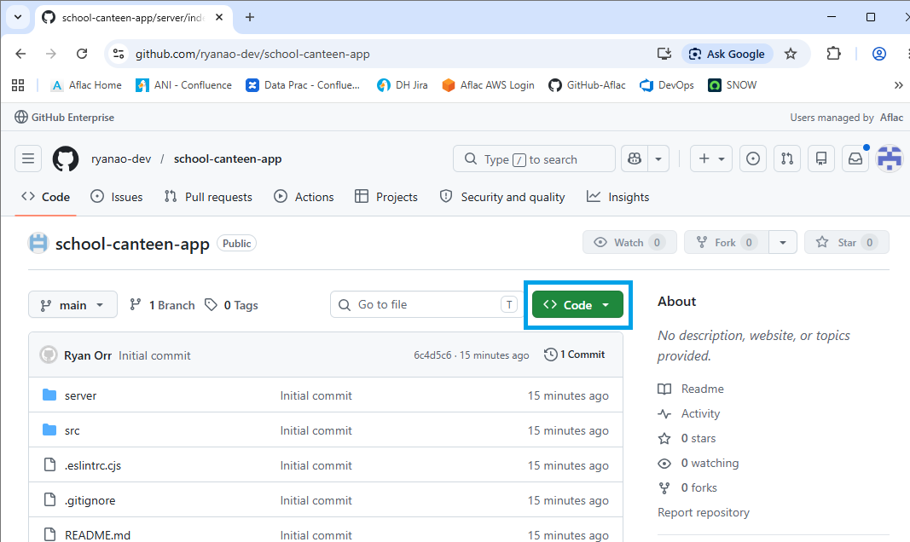

2.  Click *Download ZIP.*

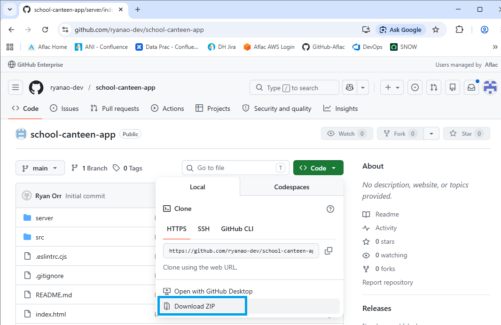

3.  Here you see the downloaded zip in [file explorer]{.mark} Downloads.

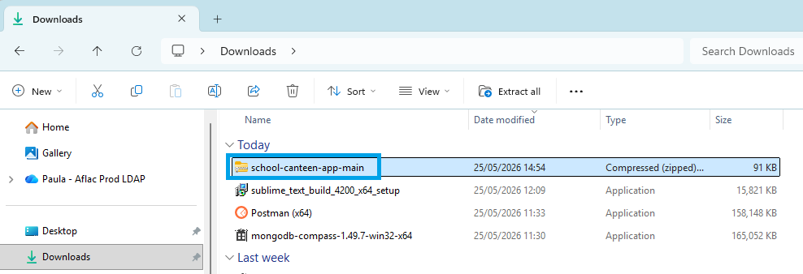

4.  Right click on school-canteen-app-main zip and click *Extract All*.

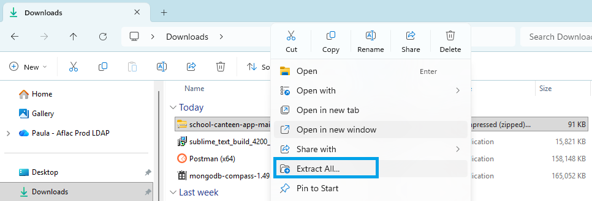

5.  Click *Extract*.

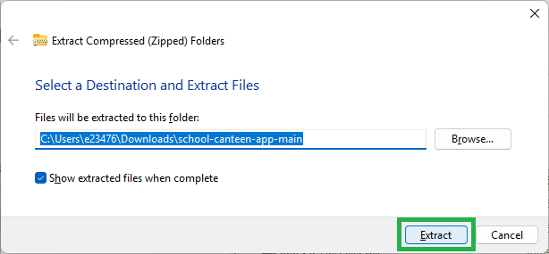

6.  Open Visual Studio Code from [desktop]{.mark}

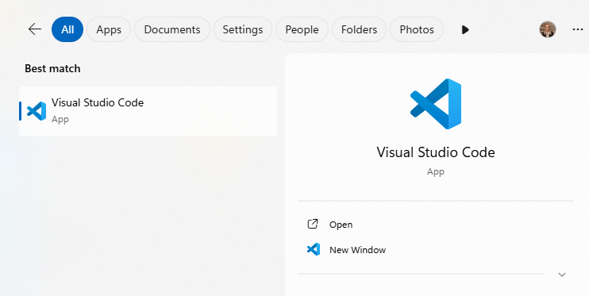

7.  From the Start Screen click *Open Folder* (or go to File Open
    Folder)

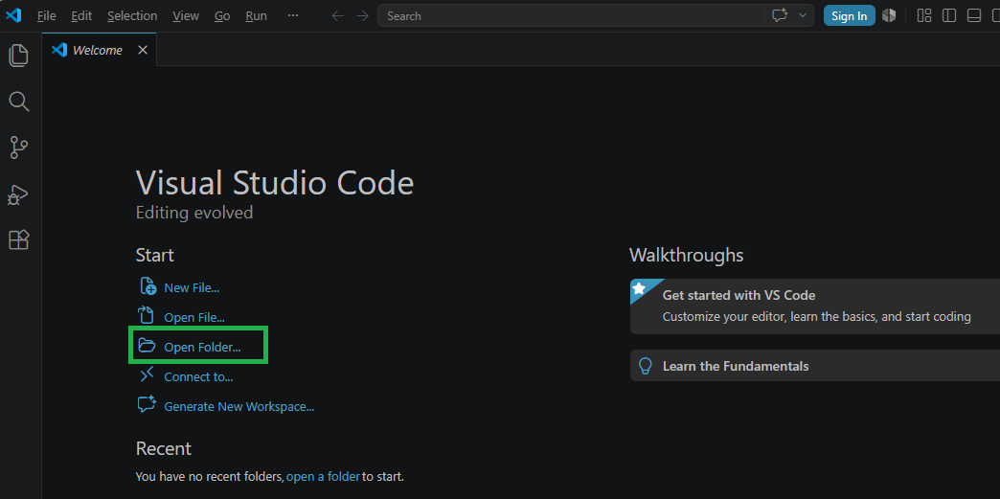

8.  Navigate to Downloads and select school-canteen-app-main folder and
    click *Select Folder*.

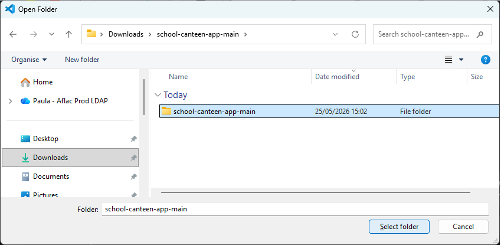

9.  Click *Yes, I trust the authors*.

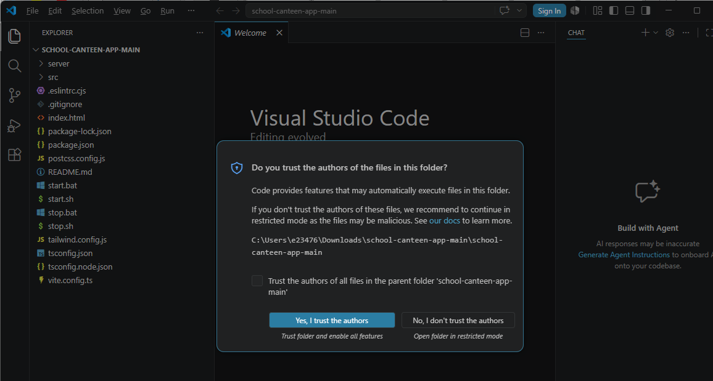

10. Open App in web browser

- Back from file explorer

- Double click on start Windows Batch File (not SH Source file) in
  Downloads school-canteen-app-main folder.

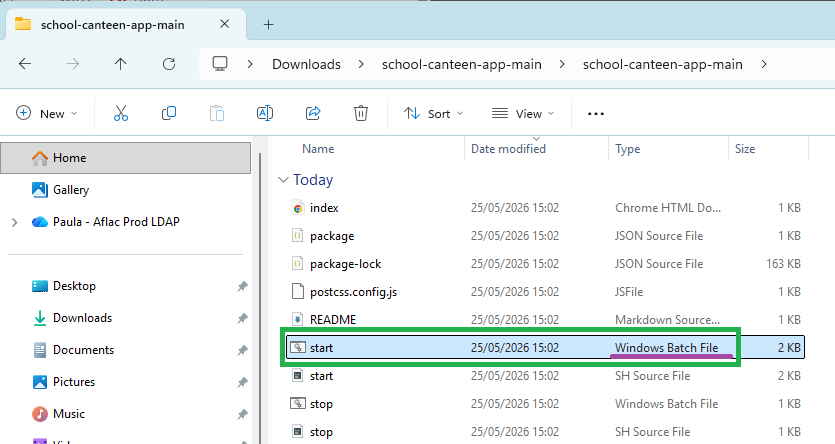

- Click on *Run*.

- Ignore any of the warnings

- This will take a few minutes to fully load

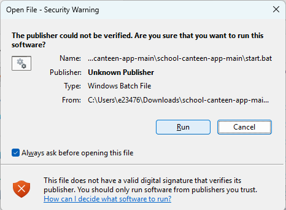

- Black command windows will open which are ok.

- The App should then open in the default web browser.

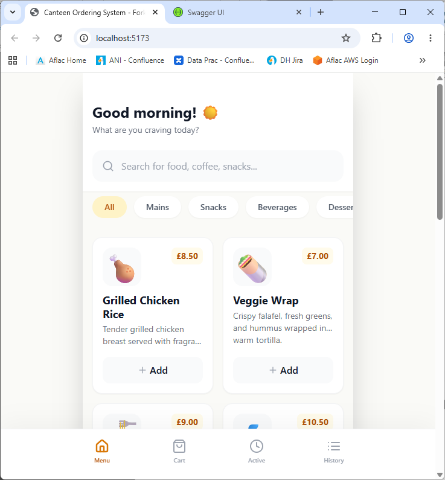

- If the School Canteen app doesn't open in the web browser hold down
  the ctrl button and click on the URL below.

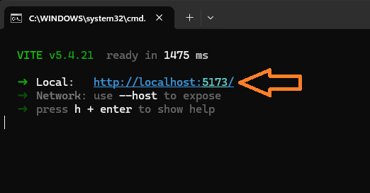

11. Open AI Assistant Kiro

- Click on the 3 dots at the top -\> Terminal -\> New Terminal

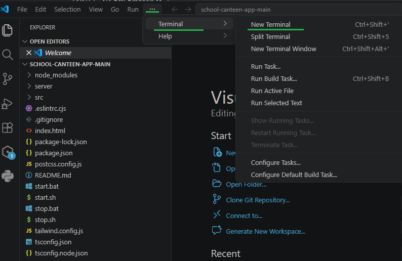

- This will open a new terminal section at the bottom of the tool.

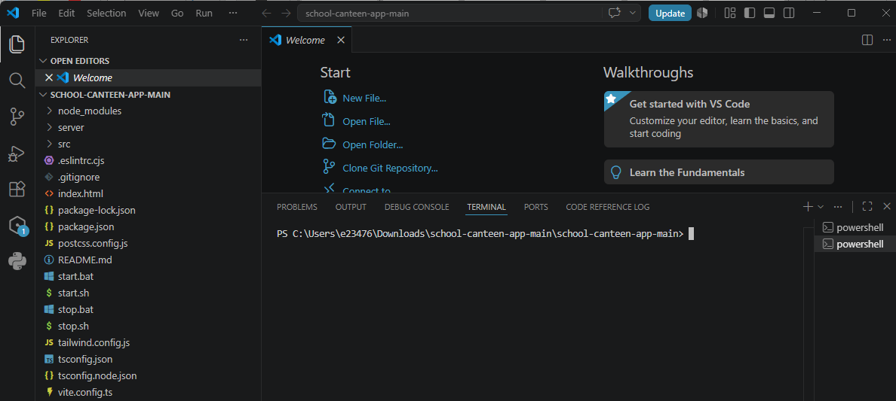

- Type in ***kiro-cli*** and press enter (or if that fails type in
  ***kiro-cli --classic*** and enter)

- This will open Kiro the AI tool you will use to help with fixes and
  changes.

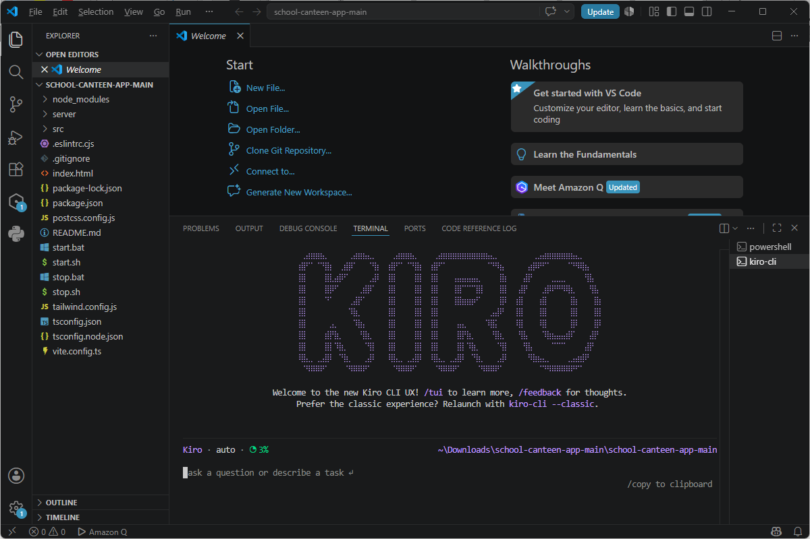
